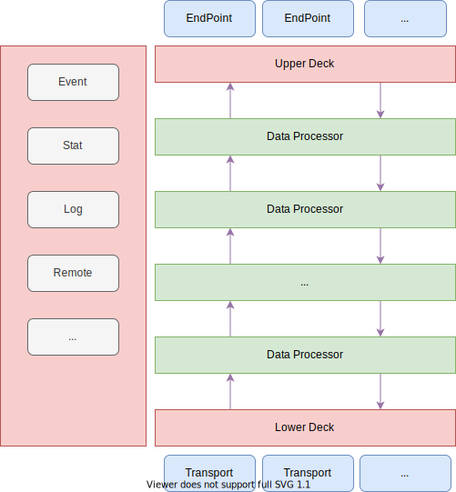
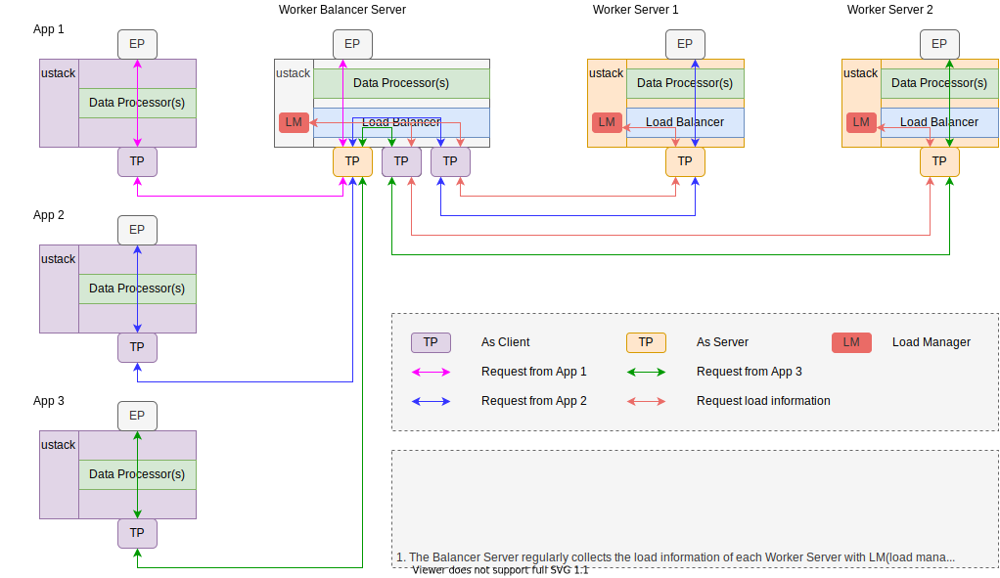

# UStack

> Hi, welcome to here, UStack is coming soon ...

## 1. What's the UStack?
`UStack` is a communication management component embedded in user space applications. It provides functions including but not limited to package statistics, forwarding, discarding, load balancing, encoding and decoding, and supports remote dynamic behavior adjustment. It is currently being implemented as planned.

----

## 2. Transport
## 3. Data Processor
### 3.1 XXX
### 3.2 YYY
### 3.x Load Balancer

### 3.y Forwader
#### 3.y.1 Cross Application

#### 3.y.2 Internal Application

## 4. End Point
